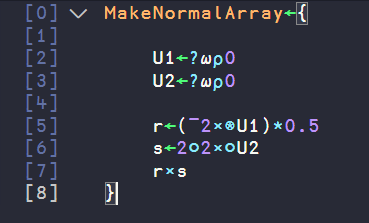
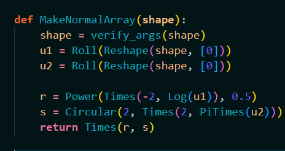
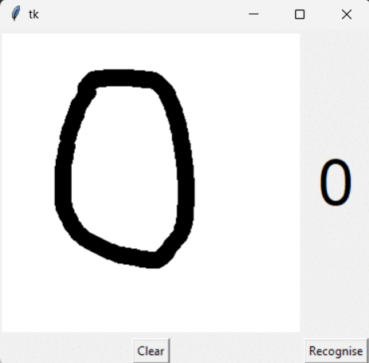

# Array Oriented Python
## A collection of APL inspired functions and operators for Python applied into a Handwritten Digit Recognition Neural Network example.

## Table of Contents
- [Introduction](#introduction)
- [Installation](#installation)
- [Documentation](#documentation)
- [Usage](#usage)
- [Final Thoughts](#final-thoughts)
- [Code Comparison](#code-comparison)

## Introduction
### What is APL?
APL is an array-oriented programming language that will change the way you think about problems and data. With a powerful, concise syntax, it lets you develop shorter programs that enable you to think more about the problem you're trying to solve than how to express it to a computer.

### What is the purpose of this project?
The purpose is to show how the array oriented paradigm represented by APL inspired functions and operators, can be used to solve problems in Python in a very concise and elegant way. 

### What is the purpose of the Handwritten Digit Recognition Neural Network example?
Since I already implemented this neural network in APL it was a good opportunity to compare the two implementations. The APL implementation is available [here](https://github.com/enzoniko/HDRNNUA) feel free to compare them yourself.

### Observations
- Only APL symbols used in the example are implemented, I did this project during my university vacations so I did not have enough time to try to implement everything, maybe one day ;).
- Because APL is array-oriented from the root, it is incredibly hard to implement it in a language that is not. This means some symbols are not implemented in the most abstract way possible and some cases might bug out, feel free to contribute.
- But I still think the array paradigm is incredibly powerful and I hope this project will help you see it too.
- I strongly recommend you to read the [APL Wiki](https://aplwiki.com/wiki/Main_Page) to understand the concepts behind APL, I promise it is worth it.

## Installation
#### Download the zipped repository, unzip it into a folder, open the folder on your IDE, run `pip install -r requirements.txt`, enjoy!

## Documentation
### APL Symbols implemented
- `Bind(g, f)`: Returns the function h(x) = f(g(x));
- `Catenate(left_vector, right_vector)`: Returns the concatenation of the two vectors;
- `PiTimes(vector)`: Returns Pi times the vector;
- `Circular(selector, vector)`: Returns a selected trigonometric function (sin[1], cos[2]) applied to the vector;
- `Divide(left_vector, right_vector)`: Returns the division of the two vectors;
- `Drop(drop_amount, vector)` : Returns the vector without the first drop_amount elements;
- `Each(f, vector)`: Returns the vector with the function f applied to each element (using multiprocessing because its cool);
- `Equal(left_vector, right_vector)`: Returns the equality of the two vectors;
- `Log(vector)`: Returns the natural logarithm of the vector;
- `Plus(vector1, vector2)`: Returns the sum of the two vectors;
- `Minus(left_vector, right_vector)`: Returns the subtraction of the two vectors;
- `Power(vector, power_vector)`: Returns the vector to the power of the power_vector;
- `Reduce(f, vector, n_wise)`: Returns the acumulated result of applying the dyadic function f to the vector n_wise elements at a time at the last axis;
- `ReduceFirst(f, vector, n_wise)`: Returns the acumulated result of applying the dyadic function f to the vector n_wise elements at a time at the first axis;
- `Shape(vector)`: Returns the Shape of the vector (Homogenous or not);
- `Reshape(shape, vector)`: Returns the vector reshaped to the given shape (Homogenous or not);
- `Roll(vector)`: Returns a randomized vector of the same shape, Roll(n) return a random number between 0 and n, Roll(0) return a random number between 0 and 1;
- `Switch(f)`: Returns the function h(x, y) = f(y, x), h is f with switched arguments;
- `Table(vector)`: Returns a 2D version of the vector;
- `Tally(vector, is_a_shape)`: Returns the number of int/float elements in the vector/shape;
- `Times(vector1, vector2)`: Returns the product of the two vectors;
- `Transpose(vector)`: Returns the transposed vector;
- `Direction(vector)`: Returns the signal of the vector;
- `Ceiling(vector)`: Returns the ceiling of the vector;
- `Maximum(vector1, vector2)`: Returns the maximum of the two vectors;
- `GradeDown(vector)`: Returns the indexes of the elements of the vector sorted in descending order;
- `Over(left_argument, left_function, right_function, right_argument)`: Applies the right function to the arguments and then applies the left function to the resulting arguments;
- `Pick(index, vector)`: Picks the element at the given index of the vector;
- `PowerOperator(left_argument, f, n, right_argument)`: Returns the result of applying the function f to the arguments n times, the left argument is fixed and the right argument is the result of the previous application;
- `InnerProduct(left_arg, left_f, right_f, right_arg)`: Inner product first combines the data along the last axis of the left argument with the data along the first axis of the right argument in an 'Outer Product' operation with the right operand. Finally a 'reduction' operation is applied to each element of the result.
- `OuterProduct(left_vector, right_vector, f)`: Makes the function operate on pairs of elements, one taken from the left argument and one from the right, till every possible combination of two elements has been used.
- `Reverse(vector)`: Returns the vector in reverse order;


#### For more information about the symbols check the [APL Docs](https://docs.dyalog.com/latest/Dyalog%20APL%20Language%20Reference%20Guide.pdf).

### Functions implemented
- `MakeNormalArray(shape)`: Returns a normalized array with the given shape;
- `InitWeightMatrices(shape)`: Initializes the weight matrices for the given shape;
- `InitBiasVectors(shape)`: Initializes the bias vectors for the given shape;
- `InitNetwork(shape)`: Initializes the weight matrices and bias vectors for the given shape and returns them;
- `LeakyReLU.F(vector)`: Returns the LeakyReLU of the vector;
- `LeakyReLU.DF(vector)`: Returns the derivative of the LeakyReLU of the vector;
- `MSELoss.Loss(target, output)`: Returns the Mean Squared Error Loss of the target and output;
- `MSELoss.DLoss(target, output)`: Returns the derivative of the Mean Squared Error Loss of the target and output;
- `F(activation_f, components)`: Helper function for the Forward Propagation;
- `ForwardPass(activation_f, network, input)`: Returns the output of the network for the given input;
- `Train(target, net, derivatives, inp)`: Trains the network for the given input and target;
- `MNIST()`: Main function, loads the MNIST dataset, initializes the network, trains it and tests it;

## Usage
### If you want to use the APL symbols you can import them like this (Need to be in the same directory):
```python
from Symbols import *

# Example:
print(Plus([1, 2, 3], [4, 5, 6]))

```
### If you want to train the neural network, run the MNIST.py file:
#### But don't forget to unzip the mnistreduced and/or the mnistdata folder, those contain the actual data the network will use.
#### You can select which one to train with in the MNIST.py file by changing the path variable and the size of the network accordingly.
#### I recommend using the mnistreduced 8x8 dataset, the other takes to long to train (that's why I provided a pretrained one).
#### It will train on 5000 and test on 600 8x8 images, this will take a while, and the accuracy will be around 60%.
#### You can improve the accuracy by adding MNIST() function calls below the last one, but it will take a lot of time.
#### The trained neural network is saved in the net.pickle file so you can use it later.  
</br>

### If you want to test the neural network, I made a simple GUI for it:
#### You can run the GUI.py file to test it.
#### You can draw a number and the neural network will try to guess it.
#### It uses a pretrained neural network that I trained on 60000 28x28 images several times, the accuracy is around 90% (tested on 10000 28x28 images).
#### I had the best result by placing the GUI on the top left corner of the screen, I recommend you to do the same.
#### This happens because the screen printing doesn't work well for some reason and it ends up offseting the drawing, this reduces the accuracy of the neural network.
</br>

## Final Thoughts
#### So, I believe that my objectives with this project were achieved, I learned a lot about APL, my Python and problem solving skills improved, I refreshed my knowledge about neural networks and showed how the array-oriented programming paradigm is extremely powerfull and can be used to solve problems in a very different way.
#### This project was filled with difficulties, but there is one problem I really wish I could solve: The Performance, I tried to optimize the code as much as I could, but it still takes a lot of time to train the neural network, and it is not even close to the APL performance, I believe that my code is not the most optimal however there is something about implementing another language's base features in a pythonic manner (with recursions and loops and all of that) that sounds like it would be a naturally slow code.
#### Another thing I wish I did is to implement all of APL's symbols, I only implemented the ones I needed, but I believe that implementing all of them would be a great learning experience and could evolve to an actual array-oriented python library (If performance was improved), maybe I will do that in the future.
#### I hope you enjoyed this project, I had a lot of fun making it, and I hope you realised that Objective-Oriented and Functional paradigms aren't the only ones, learning this distinct paradigm actually changed the way my brain thinks about problems and I will be forever gratefull to APL for this.
### If you have any questions or suggestions, feel free to contact me, I will be happy to answer them.

## Code Comparison



## GUI

